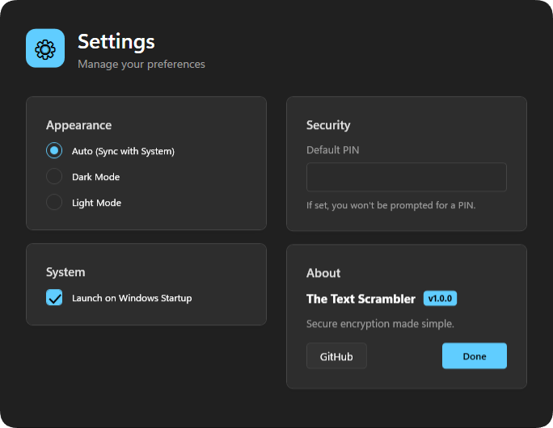

  

  # The Text Scrambler

  
  

  **A lightweight desktop utility for encrypting and decrypting text instantly using strong, industry-standard cryptography. Designed for speed, simplicity, and local-only security.**

   
  
   

## ✨ Key Features

- **🔒 In-Place Encryption**: Encrypt or decrypt selected text in any application (Notepad, Discord, Browser, etc.) using global hotkeys.
- **🛡️ Strong Cryptography**: Built on **AES-256** with **PBKDF2** (SHA-256, 10,000 iterations), using a random Salt (16 bytes) and IV (16 bytes) for every operation.
- **⚡ Local & Offline**: All processing happens locally on your machine. No network access, no telemetry, no cloud.
- **🌗 Theme Aware**: Automatically adapts to your system theme (Dark/Light mode) for a seamless native look.
- **📥 System Tray Integration**: Runs silently in the background with quick access via the system tray icon.
- **⌨️ Global Hotkeys**:
  - Encrypt: `Shift` + `E`
  - Decrypt: `Shift` + `D`
  - *Fully configurable in settings.*

### ⚡ Default PIN Feature
You can set a **Default PIN** in the settings:
- **Set a PIN**: The app will use this PIN automatically for all operations, skipping the prompt for faster usage.
- **Leave Empty**: You will be prompted to enter a PIN manually every time, allowing you to use different PINs for different messages.

  

## 🚀 How It Works

1.  **Zero Storage**: Your PIN/password is never stored anywhere.
2.  **Key Derivation**: A cryptographic key is derived from your PIN using PBKDF2 + SHA-256.
3.  **Unique Salt/IV**: A unique random Salt and IV are generated for *every* encryption.
4.  **Output**: `Salt + IV + Encrypted Data` → Base64 String.

> **Note**: Encrypting the same text with the same PIN will always produce different results due to the random salt/IV. This is a security feature.

## 📥 Installation

1.  Download the latest release from the [Releases page](https://github.com/voidksa/TheTextScrambler/releases/latest).
2.  Extract the ZIP file to any folder.
3.  Run `TextScrambler.exe`.

> **Requirements**: Windows 10/11 and .NET 8.0 Runtime.

## 🎮 Usage

1.  **Select Text**: Highlight any text in any application.
2.  **Press Hotkey**:
    - `Shift` + `E` to **Encrypt**.
    - `Shift` + `D` to **Decrypt**.
3.  **Enter PIN**: Type your PIN when the secure prompt appears.
4.  **Done**: The text is replaced instantly.

## ⚠️ Security Notes

- The security of your data depends entirely on the **strength of your PIN**.
- Short or simple PINs can be susceptible to brute-force attacks.
- **Recovery**: If you forget your PIN, the encrypted data **cannot be recovered**. There are no backdoors.

## 📄 License

This project is licensed under the **MIT License**.
Security does not rely on hiding the source code. Transparency is key.

## 👤 Credits

Created by **voidksa**
[GitHub Repository](https://github.com/voidksa/TheTextScrambler)
